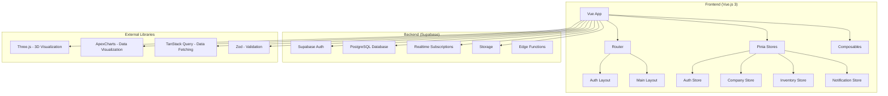

# Design Document

## Overview

This design document outlines the architecture and implementation approach for a comprehensive Vue.js 3 ERP system with multi-company support, 3D warehouse visualization, and SUNAT compliance. The system follows modern frontend architecture patterns with TypeScript, Composition API, and reactive state management.

The application is built as a Single Page Application (SPA) with multiple layouts, real-time capabilities, and extensive data visualization features. It integrates with a Supabase backend for authentication, data persistence, and real-time subscriptions.

## Architecture

### High-Level Architecture



### Technology Stack

- **Frontend Framework**: Vue.js 3 with Composition API
- **Type Safety**: TypeScript with strict mode
- **State Management**: Pinia for reactive state
- **Routing**: Vue Router 4 with navigation guards
- **Styling**: Tailwind CSS 4 with utility-first approach
- **Data Fetching**: TanStack Query for caching and synchronization
- **3D Graphics**: Three.js with @tresjs/core Vue integration
- **Charts**: ApexCharts for data visualization
- **Validation**: Zod for schema validation
- **Date Handling**: Day.js for date manipulation
- **PDF Viewing**: Vue-PDF-Viewer for document display
- **Excel Export**: SheetJS (xlsx) for spreadsheet generation
- **Backend**: Supabase (PostgreSQL, Auth, Realtime, Storage)

## Components and Interfaces

### Layout System

#### Authentication Layout

```typescript
interface AuthLayoutProps {
  title?: string
  subtitle?: string
  showLogo?: boolean
}

// Components:
// - LoginForm.vue
// - RegisterForm.vue
// - ForgotPasswordForm.vue
// - AuthLayout.vue
```

#### Main Application Layout

```typescript
interface MainLayoutProps {
  sidebarCollapsed?: boolean
  showNotifications?: boolean
}

// Components:
// - AppHeader.vue (company selector, user menu, notifications)
// - AppSidebar.vue (navigation menu)
// - AppMain.vue (router-view container)
// - MainLayout.vue
```

### Core Components Architecture

#### Navigation Components

```typescript
// AppSidebar.vue
interface SidebarItem {
  id: string
  label: string
  icon: string
  route: string
  permission?: string
  children?: SidebarItem[]
}

// AppHeader.vue
interface HeaderProps {
  currentCompany: Company | null
  userCompanies: Company[]
  unreadNotifications: number
}
```

#### Data Display Components

```typescript
// DataTable.vue - Reusable table component
interface DataTableProps<T> {
  data: T[]
  columns: TableColumn<T>[]
  loading?: boolean
  pagination?: PaginationConfig
  selection?: 'single' | 'multiple' | 'none'
}

// ChartWidget.vue - ApexCharts wrapper
interface ChartWidgetProps {
  type: 'line' | 'bar' | 'pie' | 'area'
  data: ChartData
  options?: ApexOptions
  height?: number
}
```

#### Form Components

```typescript
// FormField.vue - Reusable form field
interface FormFieldProps {
  label: string
  type: 'text' | 'number' | 'select' | 'date' | 'textarea'
  modelValue: any
  validation?: ZodSchema
  options?: SelectOption[]
  required?: boolean
}

// Modal.vue - Reusable modal component
interface ModalProps {
  show: boolean
  title: string
  size?: 'sm' | 'md' | 'lg' | 'xl'
  persistent?: boolean
}
```

### 3D Warehouse Visualization

#### Three.js Integration

```typescript
// WarehouseViewer.vue
interface WarehouseViewerProps {
  warehouseId: string
  showStockLevels?: boolean
  interactive?: boolean
}

interface WarehouseScene {
  warehouse: Warehouse
  zones: WarehouseZone[]
  locations: StorageLocation[]
  stockLevels: WarehouseStock[]
}

// 3D Scene Components:
// - WarehouseFloor.vue (floor plan rendering)
// - WarehouseZone.vue (zone visualization)
// - StorageLocation.vue (location markers)
// - StockIndicator.vue (stock level visualization)
```

### Business Logic Components

#### Inventory Management

```typescript
// ProductForm.vue
interface ProductFormData {
  sku: string
  name: string
  brandId: string
  categoryId: string
  unitCode: string
  tipoAfectacion: string
  isSerialized: boolean
  minStock: number
  dimensions?: ProductDimensions
}

// StockMovementForm.vue
interface StockMovementData {
  productId: string
  warehouseId: string
  zoneId?: string
  locationId?: string
  movementType: 'IN' | 'OUT' | 'TRANSFER'
  quantity: number
  unitCost?: number
  reference?: string
}
```

#### Document Management

```typescript
// SalesDocumentForm.vue
interface SalesDocumentData {
  customerId: string
  docType: string
  series: string
  issueDate: Date
  items: SalesDocumentItem[]
  total: number
}

// PurchaseDocumentForm.vue
interface PurchaseDocumentData {
  supplierId: string
  docType: string
  series: string
  receiptDate: Date
  items: PurchaseDocumentItem[]
  total: number
}
```

## Data Models

### Core TypeScript Interfaces

#### Authentication & Authorization

```typescript
interface User {
  id: string
  email: string
  fullName?: string
  avatarUrl?: string
  createdAt: Date
  updatedAt: Date
}

interface Role {
  id: string
  name: string
  permissions: string[]
  hierarchyLevel: number
}

interface UserCompany {
  userId: string
  companyId: string
  roleId: string
  permissionsOverride?: string[]
  validFrom: Date
  validUntil?: Date
}
```

#### Company & Organization

```typescript
interface Company {
  id: string
  ruc: string
  legalName: string
  commercialName?: string
  currencyCode: string
  valuationMethod: 'PROMEDIO_MOVIL' | 'FIFO' | 'LIFO'
  solUser?: string
  solPassword?: string
  businessConfig: Record<string, any>
  createdAt: Date
  updatedAt: Date
}

interface Branch {
  id: string
  companyId: string
  code: string
  name: string
  ubigeoCode: string
  address?: string
  isActive: boolean
}
```

#### Warehouse & Inventory

```typescript
interface Warehouse {
  id: string
  companyId: string
  branchId: string
  code: string
  name: string
  dimensions: {
    width: number
    height: number
    length: number
  }
  totalArea: number
  totalVolume: number
  address?: string
  warehouseType: 'GENERAL' | 'SPECIALIZED'
  maxCapacityKg?: number
}

interface WarehouseZone {
  id: string
  companyId: string
  warehouseId: string
  code: string
  name: string
  dimensions: {
    width: number
    height: number
    length: number
  }
  coordinates: {
    x: number
    y: number
    z: number
  }
  shapeType: 'RECTANGLE' | 'CIRCLE' | 'POLYGON'
  vertices: Array<{ x: number; y: number }>
  colorHex: string
}

interface Product {
  id: string
  companyId: string
  sku: string
  name: string
  brandId?: string
  categoryId?: string
  unitCode: string
  tipoAfectacion: string
  dimensions?: {
    width: number
    height: number
    length: number
    weight: number
  }
  isSerialized: boolean
  minStock: number
  searchVector?: string
  createdAt: Date
  updatedAt: Date
}
```

#### Documents & Transactions

```typescript
interface SalesDocument {
  id: string
  companyId: string
  customerId: string
  docType: string
  series: string
  number: string
  issueDate: Date
  dueDate?: Date
  currencyCode: string
  exchangeRate: number
  subtotal: number
  igvAmount: number
  total: number
  status: 'DRAFT' | 'ISSUED' | 'PAID' | 'CANCELLED'
  greenterXml?: string
  items: SalesDocumentItem[]
}

interface StockLedgerEntry {
  id: string
  companyId: string
  warehouseId: string
  zoneId?: string
  locationId?: string
  productId: string
  movementDate: Date
  qtyIn: number
  qtyOut: number
  unitCostIn?: number
  unitCostOut?: number
  balanceQty: number
  balanceValue: number
  reference?: string
  documentType?: string
  documentId?: string
}
```

#### Notifications & System

```typescript
interface Notification {
  id: string
  title: string
  message: string
  type: 'INFO' | 'WARNING' | 'ERROR' | 'SUCCESS' | 'STOCK_LOW' | 'DOCUMENT_PENDING'
  recipientUserId: string
  companyId: string
  data?: Record<string, any>
  isRead: boolean
  createdAt: Date
  readAt?: Date
}

interface NotificationPreference {
  id: string
  userId: string
  companyId: string
  notificationType: string
  enabledChannels: ('EMAIL' | 'PUSH' | 'IN_APP')[]
}
```

## Error Handling

### Error Handling Strategy

#### Global Error Handler

```typescript
// composables/useErrorHandler.ts
interface AppError {
  code: string
  message: string
  details?: any
  timestamp: Date
  userId?: string
  companyId?: string
}

const useErrorHandler = () => {
  const handleSupabaseError = (error: any): AppError => {
    // Transform Supabase errors to user-friendly messages
  }

  const handleValidationError = (error: ZodError): AppError => {
    // Transform Zod validation errors
  }

  const showErrorToast = (error: AppError) => {
    // Display error notification to user
  }
}
```

#### Form Validation

```typescript
// schemas/validation.ts
import { z } from 'zod'

export const productSchema = z.object({
  sku: z.string().min(1, 'SKU es requerido').max(50),
  name: z.string().min(1, 'Nombre es requerido').max(200),
  brandId: z.string().uuid().optional(),
  categoryId: z.string().uuid().optional(),
  unitCode: z.string().min(1, 'Unidad de medida es requerida'),
  isSerialized: z.boolean(),
  minStock: z.number().min(0, 'Stock mínimo debe ser mayor o igual a 0'),
})

export const salesDocumentSchema = z.object({
  customerId: z.string().uuid('Cliente es requerido'),
  docType: z.string().min(1, 'Tipo de documento es requerido'),
  issueDate: z.date(),
  items: z
    .array(
      z.object({
        productId: z.string().uuid(),
        quantity: z.number().positive(),
        unitPrice: z.number().positive(),
      }),
    )
    .min(1, 'Debe agregar al menos un item'),
})
```

## Testing Strategy

### Testing Approach

#### Unit Testing

```typescript
// tests/unit/composables/useAuth.test.ts
import { describe, it, expect, vi } from 'vitest'
import { useAuth } from '@/composables/useAuth'

describe('useAuth', () => {
  it('should login user successfully', async () => {
    // Test authentication logic
  })

  it('should handle login errors', async () => {
    // Test error scenarios
  })
})
```

#### Component Testing

```typescript
// tests/unit/components/ProductForm.test.ts
import { mount } from '@vue/test-utils'
import ProductForm from '@/components/ProductForm.vue'

describe('ProductForm', () => {
  it('should validate required fields', async () => {
    // Test form validation
  })

  it('should submit form with valid data', async () => {
    // Test form submission
  })
})
```

#### Integration Testing

```typescript
// tests/integration/stores/inventory.test.ts
import { setActivePinia, createPinia } from 'pinia'
import { useInventoryStore } from '@/stores/inventory'

describe('Inventory Store', () => {
  beforeEach(() => {
    setActivePinia(createPinia())
  })

  it('should fetch products successfully', async () => {
    // Test store integration with Supabase
  })
})
```

### Testing Configuration

#### Vitest Setup

```typescript
// vitest.config.ts
export default defineConfig({
  test: {
    environment: 'jsdom',
    globals: true,
    setupFiles: ['./tests/setup.ts'],
  },
  resolve: {
    alias: {
      '@': path.resolve(__dirname, './src'),
    },
  },
})
```

#### Mock Configuration

```typescript
// tests/setup.ts
import { vi } from 'vitest'

// Mock Supabase client
vi.mock('@/lib/supabase', () => ({
  supabase: {
    auth: {
      signIn: vi.fn(),
      signOut: vi.fn(),
      getUser: vi.fn(),
    },
    from: vi.fn(() => ({
      select: vi.fn(),
      insert: vi.fn(),
      update: vi.fn(),
      delete: vi.fn(),
    })),
  },
}))

// Mock Three.js
vi.mock('three', () => ({
  Scene: vi.fn(),
  WebGLRenderer: vi.fn(),
  PerspectiveCamera: vi.fn(),
}))
```

## Performance Optimization

### Optimization Strategies

#### Code Splitting

```typescript
// router/index.ts
const routes = [
  {
    path: '/dashboard',
    component: () => import('@/views/DashboardView.vue'),
  },
  {
    path: '/inventory',
    component: () => import('@/views/InventoryView.vue'),
  },
  {
    path: '/warehouse-3d',
    component: () => import('@/views/Warehouse3DView.vue'),
  },
]
```

#### Data Caching

```typescript
// composables/useQuery.ts
import { useQuery } from '@tanstack/vue-query'

export const useProducts = (companyId: string) => {
  return useQuery({
    queryKey: ['products', companyId],
    queryFn: () => fetchProducts(companyId),
    staleTime: 5 * 60 * 1000, // 5 minutes
    cacheTime: 10 * 60 * 1000, // 10 minutes
  })
}
```

#### Virtual Scrolling

```typescript
// components/VirtualTable.vue
// Implement virtual scrolling for large datasets
interface VirtualTableProps<T> {
  items: T[]
  itemHeight: number
  containerHeight: number
  renderItem: (item: T, index: number) => VNode
}
```

#### 3D Performance

```typescript
// composables/useWarehouse3D.ts
const useWarehouse3D = () => {
  const optimizeScene = () => {
    // Implement LOD (Level of Detail)
    // Use instanced rendering for repeated objects
    // Implement frustum culling
    // Use texture atlasing
  }
}
```

## Security Considerations

### Security Implementation

#### Authentication Guards

```typescript
// router/guards.ts
export const authGuard = (to: RouteLocationNormalized) => {
  const { isAuthenticated } = useAuth()

  if (!isAuthenticated.value) {
    return { name: 'login' }
  }
}

export const permissionGuard = (permission: string) => {
  return (to: RouteLocationNormalized) => {
    const { hasPermission } = useAuth()

    if (!hasPermission(permission)) {
      throw new Error('Insufficient permissions')
    }
  }
}
```

#### Data Sanitization

```typescript
// utils/sanitization.ts
export const sanitizeInput = (input: string): string => {
  // Remove potentially dangerous characters
  return input.replace(/<script\b[^<]*(?:(?!<\/script>)<[^<]*)*<\/script>/gi, '')
}

export const validateFileUpload = (file: File): boolean => {
  const allowedTypes = ['image/jpeg', 'image/png', 'application/pdf']
  const maxSize = 10 * 1024 * 1024 // 10MB

  return allowedTypes.includes(file.type) && file.size <= maxSize
}
```

#### RLS Integration

```typescript
// lib/supabase.ts
export const createSupabaseClient = () => {
  const supabase = createClient(
    import.meta.env.VITE_SUPABASE_URL,
    import.meta.env.VITE_SUPABASE_ANON_KEY,
    {
      auth: {
        persistSession: true,
        autoRefreshToken: true,
      },
    },
  )

  // Ensure RLS is enforced
  supabase.auth.onAuthStateChange((event, session) => {
    if (session) {
      // Set user context for RLS
      supabase.rpc('set_user_context', {
        user_id: session.user.id,
      })
    }
  })

  return supabase
}
```

This design provides a comprehensive foundation for building the Vue.js ERP system with proper architecture, component organization, data modeling, error handling, testing strategy, performance optimization, and security considerations.
